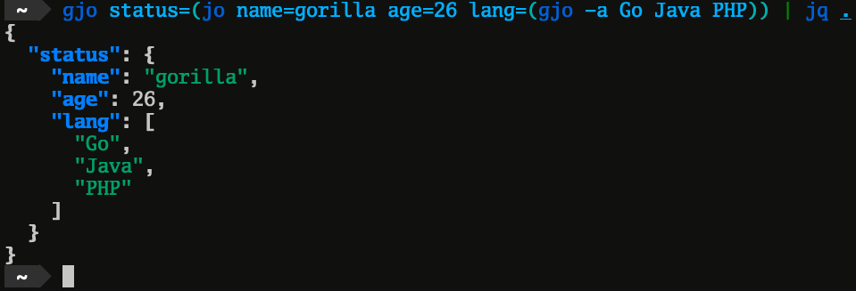

# gjo
Small utility to create JSON objects.  
This was inspired by [jpmens/jo](https://github.com/jpmens/jo).



## Requirements
- Go 1.1.14~
- Git

## Installtion
```sh
$ git clone https://github.com/skanehira/gjo.git
$ cd gjo
$ GO111MODULE=on go install
```

## Usage
```sh
$ gjo name=gorilla age=26 isGorilla=true
{"age":"26","isGorilla":true,"name":"gorilla"}
$ gjo -h
Usage of gjo:
  -f    format json
  -v    show version
```

## Author
gorilla0513
